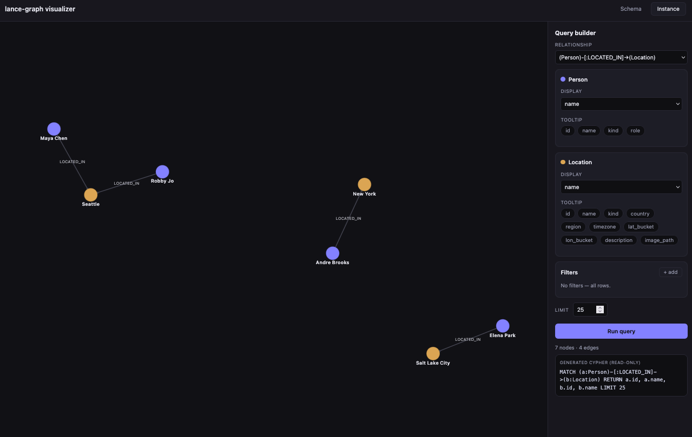

# Multimodal Knowledge Graphs with HDC + lance-graph

A small, self-contained demo that combines two ways of looking at the same data: really high-dimensional vector space (10K dimensions) and property graphs. [LanceDB](https://lancedb.com) is used as the storage, providing two forms of retrieval over the data:

- **Associative search** via **Hyperdimensional Computing (HDC)** — fuzzy, similarity-based
  retrieval that answers vague, compositional questions like *"persons from cities on the
  pacific coast with mountains nearby."*
- **Property-graph traversal** via **[lance-graph](https://github.com/lancedb/lance-graph)** —
  exact, schema-valid Cypher over the same tables.

Both views live in **one [Lance](https://lance.org)** dataset. Lance is a multimodal lakehouse format that's well suited for HDC.
Graph facts, high-dimensional vectors (hypervectors), and native storage of multimodal assets (images, video, sensor traces, and more) are all columns of the same table — indexed and versioned together, with no need to manage multiple systems to keep them in sync. LanceDB is the data management platform and lakehouse built on top of the Lance format.

The core idea in this demo is this: we let HDC propose **could-be-true** candidates from fuzzy intent-style queries, and let the graph confirm **what is known to be true**, based on the facts it stores.

A knowledge graph and a hyperdimensional vector space are just two
representations of the same data in two different topological spaces — one discrete and exact, one
continuous and fuzzy.

> [!NOTE]
> This demo is deliberately tiny (4 people, 3 cities). The multimodal "vibe" features in
> [data/features/location_vibes.csv](data/features/location_vibes.csv) are hand-authored
> stand-ins shaped exactly like the captions a vision model (CLIP / a vision-LLM) would emit.

## What is HDC?

**Hyperdimensional Computing (HDC)** represents every concept — a person, a city, a feature like
"mountains" — as a single very high-dimensional vector (here, 10,000 numbers). The trick is that in
such a large space, two randomly chosen vectors are almost always nearly perpendicular, so each
concept starts out effectively unique and unrelated to the others. You then build meaning with just
two operations: **bundling** (add vectors together to form a set or "bag" of things, where the
result stays *similar* to each ingredient) and **binding** (multiply vectors to tie a role to a
value, where the result is *dissimilar* to its parts but can be cleanly undone later).

That's enough to encode a whole record as one vector and to ask fuzzy, compositional questions of it
by comparing vectors with a similarity score. Because the space is continuous, answers *degrade
gracefully*: a city that matches most of a query scores high, one that matches only part of it
scores lower, and something unrelated scores near zero — no exact keyword or column ever has to
match. That soft, similarity-based matching is what complements the exact, schema-bound graph
traversal in the rest of this demo.

## The data

The graph follows a compact pattern:

```cypher
(:Person)-[:LOCATED_IN]->(:Location)
```

Four people across three cities: Robby Jo and Maya Chen in Seattle, Andre Brooks in New York, and
Elena Park in Salt Lake City. The source of truth is plain CSV under [data/](data/), loaded with
Polars:

| File | Role |
|------|------|
| [data/nodes/person.csv](data/nodes/person.csv) | Person nodes |
| [data/nodes/location.csv](data/nodes/location.csv) | Location nodes (with `timezone`, `region`, lat/lon buckets, `image_path`) |
| [data/relationships/located_in.csv](data/relationships/located_in.csv) | `LOCATED_IN` edges |
| [data/features/location_vibes.csv](data/features/location_vibes.csv) | Derived multimodal features (`mountains`, `pacific_coast`, `waterfront`, …) with VLM-style `evidence` captions |
| [img/](img/) | Skyline images (`seattle.jpg`, `nyc.jpg`, `salt-lake-city.jpg`) |

Note the deliberate mismatch that motivates the whole demo: `timezone` (`pacific`/`eastern`/`mountain`)
is a real graph column, but `pacific_coast` is **not** — it exists only as a derived vibe feature.
Exact Cypher can't match a concept that was never a column; HDC can.

## How it works

The build runs in two stages, both writing to the same dataset:

1. **`graph_ingest.py`** ingests the raw CSVs into a LanceDB dataset (`person-location/`) as three
   tables: `Person`, `Location`, `LOCATED_IN`.
2. **`hdc_encode.py`** adds 10,000-dimensional hypervector columns to those same tables:

   | Column | What it encodes |
   |--------|-----------------|
   | `Person.hv`, `Location.hv` | Entity property bags |
   | `Location.vibe_hv` | A bundle of fuzzy multimodal features per city |
   | `LOCATED_IN.hv` | The subject–predicate–object binding `hv(person) * hv(LOCATED_IN) * hv(location)` |
   | `LOCATED_IN.vibe_hv` | The multimodal path vector, searched at query time |

At query time (`hdc_retrieve.py`), a natural-language query is mapped to vibe features, a query path
vector is built, and stored `vibe_hv` columns are ranked by cosine similarity. `lance-graph`
(`graph_retrieve.py`) then traverses from each matching location to the people connected by real
`LOCATED_IN` edges — the validation step.

### HDC primitives (via [TorchHD](https://github.com/hyperdimensional-computing/torchhd))

Defined in [src/torchhd_encoder.py](src/torchhd_encoder.py):

- **Hypervector**: a 10,000-dim bipolar (MAP) vector, one per symbolic token, from a seeded
  deterministic random embedding. Random high-dim vectors are nearly orthogonal by default —
  everything rests on this.
- **Binding** (`multibind`): associates vectors; the result is *dissimilar* to its parts and is
  reversible. Used to encode `subject * predicate * object`.
- **Bundling** (`bundle` / `torchhd.multiset`): superposition; the result stays *similar* to each
  ingredient. Used to accumulate a node's property/feature bag.

## Hypervector representation lifecycle

Every vector here is a **MAP** hypervector. MAP ("Multiply–Add–Permute") is the vector-symbolic
model TorchHD uses by default: each atomic token is a 10,000-dim vector of `±1`, **bundling** is
element-wise *addition*, and **binding** is element-wise *multiplication*. 

Mathematically, both binding and bundling are **exactly invertible** operations, but in practice (when working with TorchHD), we have to understand when to store normalized vs. raw hypervectors so that the original hypervectors are recoverable after running numerical operations on them.

- **Binding is exactly invertible: but only when every factor is `±1`.** Because `(+1)² = (-1)² =
  1`, each factor is its own inverse, so `a * b * c` multiplied by the known `a` and `b` recovers
  `c` exactly. Feed in a factor with any other value and that guarantee is gone.
- **Bundling is exactly invertible: but only if you keep the sum intact.** The bundle of A, B, C
  is the literal element-wise sum, so its coordinates are small integers (…, `-2`, `0`, `3`, …)
  that record *how many* ingredients — and *how strongly* — voted at each position. Add or subtract
  a member and you land exactly on the smaller bundle. Collapse that sum back down to `±1` and the
  counts are lost for good.

The un-collapsed, integer-valued vector are **unnormalized**, and the sign-only `±1` version is its
**normalized (bipolar)** form. As a user working with HDC using TorchHD, all you need to know is that binding wants normalized factors; bundling wants the unnormalized counts — so the two kinds of table deliberately store different forms.

### Storage: what each LanceDB table holds

We create multiple LanceDB tables as follows:

- **Node rows (`Person.hv`, `Location.hv`, `Location.vibe_hv`) store unnormalized sums.** A Location such as
  Seattle is the full-precision sum of its bound role/value associations (`feature -> mountains`,
  `feature -> pacific_coast`, …). Keeping the integer coordinates preserves feature weights and
  supports *exact* additive insert/remove — which is why `bundle()` must **never** normalize
  internally.
- **Relationship rows (`LOCATED_IN.hv`, `LOCATED_IN.vibe_hv`) store bipolar products.** Before a
  node sum enters an S-P-O binding, `normalize_for_binding()` collapses it to `{-1, +1}` so the
  multiply stays self-inverse and a known subject + predicate recover the encoded object exactly.
- **Zero coordinates are broken deterministically.** An even-sized unnormalized sum can land on exactly `0`,
  which has no sign to keep; a stable context (e.g. `Location:seattle`) seeds a random `±1` tie
  vector, avoiding a global `0 -> -1` bias while keeping rebuilds reproducible.

Normalize *only* at that node → binding boundary; everywhere else the unnormalized vector is the source of truth.

## Setup

Requires **Python 3.13+** and [uv](https://docs.astral.sh/uv/). Install the dependencies as follows:

```bash
uv sync
```

This included direct dependencies: `lancedb`, `lance-graph`, `polars`, `pyarrow`, `torch`, `torch-hd`, plus
`fastapi` / `uvicorn` for the visualizer backend.

You can install additional dependencies as needed using the `uv add` command.

## Running the demo

The end-to-end path builds the dataset and runs the combined fuzzy + graph query:

```bash
uv run python src/run_person_location_demo.py
```

By default it asks *"persons from cities on the pacific coast with mountains nearby"*:

```text
Question: persons from cities on the pacific coast with mountains nearby

LanceDB HDC matches, expanded through lance-graph:
  - Maya Chen -> Seattle (pacific, score=0.742, features=mountains, pacific_coast, scenic_urban)
  - Robby Jo -> Seattle (pacific, score=0.742, features=mountains, pacific_coast, scenic_urban)
  - Elena Park -> Salt Lake City (mountain, score=0.444, features=mountains, nature_access, mountain_west)

All lance-graph validation paths:
  - Andre Brooks -> New York (eastern)
  - Elena Park -> Salt Lake City (mountain)
  - Maya Chen -> Seattle (pacific)
  - Robby Jo -> Seattle (pacific)
```

Seattle (**0.742**) ranks above Salt Lake City (**0.444**): SLC genuinely *has* mountains, so it's a
real candidate above the 0.20 threshold, but it's missing `pacific_coast`, so it ranks lower. The
ranking **degrades gracefully** instead of going binary — that 0.742-vs-0.444 gap is the whole thesis
in two numbers.

Pass your own query with `--query`:

```bash
uv run python src/run_person_location_demo.py --query "concrete jungle"
```

### Running the stages separately

**1. Build the graph tables, then add HDC columns.** Run these once before any query below:

```bash
uv run python src/graph_ingest.py
uv run python src/hdc_encode.py
```

```text
Wrote shared LanceDB graph tables: .../person-location
Added HDC columns to shared LanceDB dataset: .../person-location
Wrote HDC vocabulary: .../person-location/vocabulary.json
```

**2. Exact graph queries (lance-graph / Cypher).** These match on real schema columns only:

```bash
uv run python src/graph_retrieve.py --city Seattle
```

```text
{'person': 'Maya Chen', 'city': 'Seattle'}
{'person': 'Robby Jo', 'city': 'Seattle'}
```

```bash
uv run python src/graph_retrieve.py --timezone pacific
```

```text
{'person': 'Maya Chen', 'city': 'Seattle', 'timezone': 'pacific'}
{'person': 'Robby Jo', 'city': 'Seattle', 'timezone': 'pacific'}
```

```bash
uv run python src/graph_retrieve.py --query "MATCH (p:Person)-[:LOCATED_IN]->(l:Location) RETURN p.name AS person, l.name AS city ORDER BY city, person"
```

```text
{'person': 'Andre Brooks', 'city': 'New York'}
{'person': 'Elena Park', 'city': 'Salt Lake City'}
{'person': 'Maya Chen', 'city': 'Seattle'}
{'person': 'Robby Jo', 'city': 'Seattle'}
```

**3. Fuzzy HDC queries.** These rank cities by cosine similarity over `vibe_hv`, then expand to people:

```bash
uv run python src/hdc_retrieve.py --query "persons from cities on the pacific coast with mountains nearby"
```

```text
{'person': 'Maya Chen', 'city': 'Seattle', 'timezone': 'pacific', 'features': ['mountains', 'pacific_coast', 'scenic_urban'], 'score': 0.742}
{'person': 'Robby Jo', 'city': 'Seattle', 'timezone': 'pacific', 'features': ['mountains', 'pacific_coast', 'scenic_urban'], 'score': 0.742}
{'person': 'Elena Park', 'city': 'Salt Lake City', 'timezone': 'mountain', 'features': ['mountains', 'nature_access', 'mountain_west'], 'score': 0.444}
```

```bash
uv run python src/hdc_retrieve.py --query "places with mountains"
```

```text
{'person': 'Elena Park', 'city': 'Salt Lake City', 'timezone': 'mountain', 'features': ['mountains', 'nature_access', 'mountain_west'], 'score': 0.62}
{'person': 'Maya Chen', 'city': 'Seattle', 'timezone': 'pacific', 'features': ['mountains', 'pacific_coast', 'scenic_urban'], 'score': 0.517}
{'person': 'Robby Jo', 'city': 'Seattle', 'timezone': 'pacific', 'features': ['mountains', 'pacific_coast', 'scenic_urban'], 'score': 0.517}
```

Note how the ranking flips versus the previous query: dropping the `pacific_coast` signal lets Salt
Lake City (pure mountains) edge ahead of Seattle.

```bash
uv run python src/hdc_retrieve.py --query "concrete jungle"
```

```text
{'person': 'Andre Brooks', 'city': 'New York', 'timezone': 'eastern', 'features': ['dense_skyline', 'urban_energy', 'concrete_jungle'], 'score': 0.736}
```

The runner rebuilds `person-location/` (the shared dataset) and `person-location/vocabulary.json`
(the HDC vocabulary) from the current CSV rows each time.

To grow the demo, add rows to the CSVs under [data/](data/), then rerun `graph_ingest.py` followed by
`hdc_encode.py` (the HDC step assumes the graph tables already exist).

## Visualizing the graph

A two-view React + FastAPI visualizer lives in [viz/](viz/):

- **Schema view** — the meta-graph (labels, properties, relationships) derived from the graph config
  and each table's Arrow schema. Embedding columns (`hv`, `vibe_hv`) are badged, never drawn.
- **Instance view** — a query *builder*: pick a relationship, per-label display/tooltip columns, and
  structured filters. The backend constructs Cypher from your selections and returns a node-link
  graph; the generated Cypher is shown read-only.

The Cypher engine (`lance_graph.CypherEngine`) is Python-only, so the browser never touches it — a
FastAPI backend serves JSON and the React frontend draws it.

Run the two processes (build the dataset first if you haven't):

```bash
# 1. Backend (port 8000) — wraps build_engine() from src/graph_retrieve.py
uv run uvicorn graph_api:app --app-dir src --reload

# 2. Frontend (must be port 5173 — the backend CORS allowlist pins it)
cd viz && npm install && npm run dev
```

Then open **http://localhost:5173**. The preview will showcase a property graph visualization as follows:



To point the whole stack at a different dataset, edit `GRAPH_SCHEMA` in
[src/graph_retrieve.py](src/graph_retrieve.py) — both the engine and the visualizer follow it.
See [viz/README.md](viz/README.md) for the API contract.

## Cost caveats

- **Compute** — base token hypervectors are a one-time seeded random embedding (cheap,
  deterministic), but *every* entity and path encode is a stack of binds/bundles over 10,000-dim
  tensors. At graph scale that's real per-row tensor work (batchable and can be parallelized, but it's a non-trivial compute cost).
- **Storage** — one float32 hypervector is 10,000 dims × 4 bytes = **40 KB**, and rows carry both
  `hv` and `vibe_hv`:

  | Scale | Vectors stored | Approx. raw size (float32, pre-indexing) |
  |-------|----------------|------------------------------------------|
  | This demo | a handful | kilobytes |
  | 1M edges × (`hv` + `vibe_hv`) | 2M vectors | ~80 GB |

Compression / quantization (binary/bipolar packing, dimensionality choices, learned compression) and ANN indexing of the `hv` columns are real levers a production system would need, which [LanceDB](https://lancedb.com) is well-suited for.
